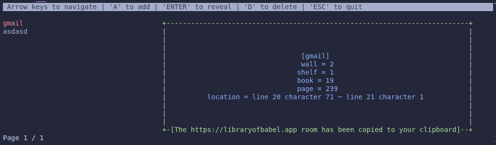

  

# very epic pitch
who needs a database anyway? [all information is already public](https://libraryofbabel.app), so why bother?
presenting "Passwords of Babel", the beautiful PHP TUI app that stores your passwords.... nowhere! It just points you to where they already are public

# how to run
- only works on Linux (windows users not allowed in this house)
- have `php-cli` 8.5 with `curl` extension
- have `wl-copy`
- just uhh just.. just do `php app.php`
- ponder your life choices

# faq totally not meant to glaze myself
- Q: Did you write a PHP TUI library just for this pos?
- A: Yes :sunglasses:
- Q: AI USAGE????? DID YOU SLOPP???????????
- A: crypto.php and babel.php were made by GPT 5.4 XHigh (im poor) but I made the lib all by myself also fun fact you should check out commit "my cool app 8" and then see what myphptui.php looked like this is how you know I didn't slop but also it became unmaintainable (php moment amirite) so i rewrote cleaner

**DISCLAIMER**

DON'T ACTUALLY USE THIS